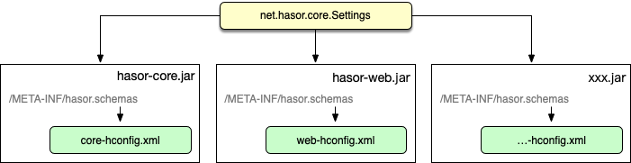

# 配置模块化

:::tip
在 Hasor 中一个 java 项目可以含有多个工程，每个工程都是独立的 Jar/War 包。而每个工程都可以定义自己的 hconfig 配置文件。

最后这些分散在不同工程中的配置信息，将会在项目启动时重新汇聚在一起。这就是 Hasor 的配置文件模块化。
:::

配置文件模块化的最典型应用场景就是：多工程项目

## 步骤

- 创建一个多工程的 java 项目
- 在每个工程的 classpath 下新建 META-INF 目录
- 在 META-INF 目录下创建 hasor.schemas 文件
- 填入 hconfig.xml 文件在 classpath 中的路径（以 hasor-core 自身为例，它的 hasor.schemas 内容如下）

```text
/META-INF/hasor-framework/core-hconfig.xml
```

在一个工程中可以有多个 hconfig 配置文件，只要这些配置文件按照每一行一个的形式写下去。

## 加载原理

Hasor 会在启动的时候扫描所有jar包中的 `hasor.schemas` 文件，然后将其汇聚到一起去重后依次加载它们。最后并且封装成 `net.hasor.cobble.setting.Settings` 接口。



## 命名空间

当配置文件被拆分为多个模块之后，不同到配置文件中可能存在相同配置。这样会造成 配置冲突 ，此时需要使用Xml的命名空间进行隔离。

通过 xml 命名空间，把不同配置进行隔离。例如：

```xml
<?xml version="1.0" encoding="UTF-8"?>
<config xmlns="http://mode1.myProject.net"><!-- Xml 命名空间隔离 -->
    <serverLocal url="www.126.com" />
</config>

<?xml version="1.0" encoding="UTF-8"?>
<config xmlns="http://mode2.myProject.net"><!-- Xml 命名空间隔离 -->
    <serverLocal url="www.souhu.com" />
</config>
```
