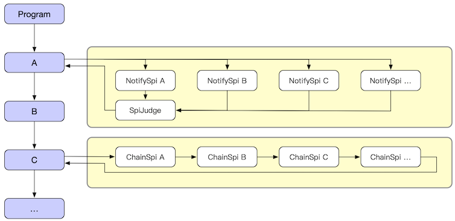

# 6.2 SPI

:::tip
SPI 全称 Service Plugin Interface，它的本真意图是在应用执行流程过程中，安插一些扩展点。
通过这些扩展点让一个看似固定的代码流程变得可以动态扩展。甚至影响执行流程中的状态。

提示：当前版本支持使用 Java 标准方式来声明 SPI（即：`META-INF/services/xxxx` 方式）。
:::

SPI 分为两种模式，它们的工作原理如下：



## notifySpi（通知型）

每个SPI在被调用的时彼此并不能互相影响。notifySpi 在执行的时候如果带有返回值，那么这个返回值会被用作发起调用 SPI 之后的返回值返回。

但当一个 notifySpi 注册了多个监听器时。由于发起 SPI 调用只能有一个返回值，因此需要 SpiJudge 来协助返回值的选择，默认 SpiJudge 是选取最后一个。

## chainSpi（链型）

链型的类似 AOP 拦截器或者叫做 Filter 过滤器，它存在的目的是让 Spi监听器 允许出现前后依赖关系。利用这个关系 SPI 监听器可以实现更为复杂的逻辑。

:::tip
关于SPI命名
- 通常而言 notifySpi 监听器的命名会以 xxxListener 形式出现。
- 而 chainSpi 监听器的命名则 xxxxChainSpi 形式居多。
:::

## SPI 监听器

无论是 `notifySpi` 还是 `chainSpi` 一个 SPI 监听器必须是继承或者实现 `java.util.EventListener` 接口。除此之外两种类型的 SPI 在定义的时候并无实质区别。

## SPI 触发器

`ChainSpi` 和 `NotifySpi` 的主要区别就在于使用了不同的 SPI 触发器方法进行触发，进而执行不同的 SPI 处理流程。

我们假设一个简单的例子，一共要打印三行控制台输出。这个程序是这个样子的：

```java
System.out.println("A");
System.out.println("B");
System.out.println("C");
```

现在，我们希望在不影响代码流程的情况下。在输出 B 这个代码之前插入若干流程，流程是通过 SPI 的方式动态注册的。首先声明一个 SPI 接口。

```java
public interface MySpiListener extends EventListener {
    public void doSpi();
}
```

然后改动现有代码，在适当的地方安插调用 SPI 的逻辑。

```java
@Inject
private SpiTrigger spiTrigger；

System.out.println("A");
// do spi
spiTrigger.notifySpiWithoutResult(MySpiListener.class, new SpiCallerWithoutResult<MySpiListener>() {
    public void doSpi(MySpiListener listener) throws Throwable {
        listener.doSpi();
    }
});

System.out.println("B");
System.out.println("C");
```

最后可以在 Module 的加载过程中注册 `MySpiListener`。

```java
public class RootModule implements Module {
    public void loadModule(ApiBinder apiBinder) throws Throwable {
        ...
        apiBinder.bindSpiListener(MySpiListener.class, new MySpiListenerImpl());
        ...
    }
}
```

## SPI 仲裁器

冲裁器有两个作用
- 一个是可以决定最终执行的 SPI 监听器是哪些，以及它们的顺序。
- 另一个作用是帮助 NotifySpi 型 SPI 调用决定采用哪个返回值。

```java
// 注册监听器
AppContext appContext = Hasor.create().build(apiBinder -> {
    apiBinder.bindSpiListener(TestSpi.class, (obj) -> {
        ...
        return dataA;
    });

    apiBinder.bindSpiListener(TestSpi.class, (obj) -> {
        ...
        return dataB;
    });

    apiBinder.bindSpiJudge(TestSpi.class, new SpiJudge() {
        // 改变仲裁默认行为，可以选取第一个值
        public <R> R judgeResult(List<R> result, R defaultResult) {
            return result.get(0);
        }

        // 决定那些 SPI 有效，并且它们的顺序
        public <T extends java.util.EventListener> List<T> judgeSpi(List<T> spiListener) {
            return spiListener;
        }
    });
});

// 触发 SPI 调用
SpiTrigger spiTrigger = appContext.getInstance(SpiTrigger.class);
Object resultSpi = spiTrigger.notifySpi(TestSpi.class, new SpiCaller<TestSpi, Object>() {
    public Object doResultSpi(TestSpi listener, Object lastResult) throws Throwable {
        return listener.doSpi(lastResult);
    }
}, defaultResult);

// 2个SPI，默认仲裁会返回最后一个 dataB 而不是 dataA
assert resultSpi == dataA;
```
