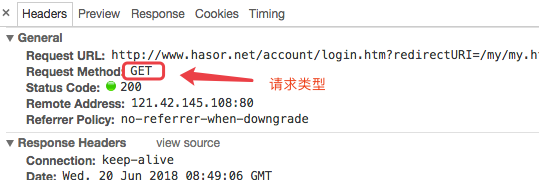

# 区分请求类型

如果你不知道什么是请求类型，那么请看这里：



如果一个方法希望接收所有类型的请求，可以标记 `@Any`。如果想区分请求类型，可以如下例子用不同方法接收 POST 和 GET：

```java
@MappingTo("/helloAction.do")
public class HelloAction {
    @Post
    public void doPost() {
        ...
    }
    @Get
    public void doGet() {
        ...
    }
}
```

Hasor 默认提供的请求类型注解有：

| 注解         | 含义            |
|------------|---------------|
| `@Any`     | 表示 任意 类型的请求   |
| `@Get`     | 表示 GET 请求     |
| `@Post`    | 表示 POST 请求    |
| `@Put`     | 表示 PUT 请求     |
| `@Head`    | 表示 HEAD 请求    |
| `@Options` | 表示 OPTION 类请求 |

:::tip
Hasor 中支持同时标记多种请求类型处理标记，例如：同时使用 `@Get` 和 `@Post`。
:::
