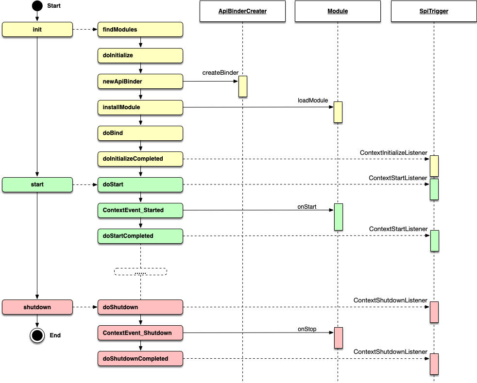

# 2.6 Lifecycle

Hasor's lifecycle is roughly divided into three phases: init, start, and shutdown.

Init phase:
- `findModules`: finds all loadable modules in the configuration file.
- `doInitialize`: marks the start of the init phase. The default implementation is empty.
- `newApiBinder`: creates the `ApiBinder` object used by modules when executing `loadModule`. `ApiBinder` extension support is also provided here.
- `installModule`: loads each module. Simply put, this is a loop.
- `doBind`: container-level initialization. This process is divided into `doBindBefore`, `installModule`, and `doBindAfter`.
- `doInitializeCompleted`: marks the end of the init phase. The default implementation is empty.

Start phase:
- `doStart`: marks the start of the start phase.
- `fireSyncEvent`: sends the `ContextEvent_Started` event through the event mechanism.
- `doStartCompleted`: marks the end of the start phase.

Shutdown phase:
- `doShutdown`: marks the start of the shutdown phase.
- `fireSyncEvent`: sends the `ContextEvent_Shutdown` event.
- `doShutdownCompleted`: marks the end of the shutdown phase.
