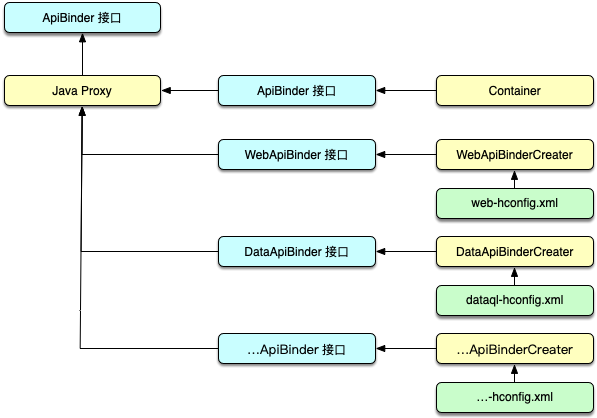

# ApiBinder

:::tip
The `ApiBinder` extension mechanism was added after Hasor 2.3. It helps applications or tool frameworks build their own interaction interfaces during the init phase.

Its greatest value is a unified development experience. Programs extended through `ApiBinder` can have their loading and initialization flow integrated into modules.

This capability makes extension tools feel native to Hasor, even when they are third-party tools.
:::

## Principle

During Hasor's init process, in the `newApiBinder` phase, Hasor collects all `ApiBinder` extension points from configuration files and creates them.



The created extension-point objects are stored in a map named `supportMap`. The map key is the user-defined `ApiBinder` interface.

Finally, these extension-point types are combined into one proxy object through Java's dynamic proxy mechanism. Every method call is then automatically routed to the corresponding API provider.

## Example

In the following example, the type is `net.test.binder.TestBinder`. First, register an `ApiBinder` extension in the Hasor configuration file. The `TestBinderCreator` class implements the `net.hasor.core.binder.ApiBinderCreator` interface.

```xml
<?xml version="1.0" encoding="UTF-8"?>
<config xmlns="http://www.hasor.net/sechma/main">
    <hasor.apiBinderSet>
        <!-- Register the extension. -->
        <binder type="net.test.binder.TestBinder">net.test.binder.TestBinderCreator</binder>
    </hasor.apiBinderSet>
</config>
```

The `TestBinderCreator` implementation is shown below:

```java
public interface TestBinder extends ApiBinder {
    public void hello();
}

public class TestBinderImpl extends ApiBinderWrap implements TestBinder {
    public TestBinderImpl(ApiBinder apiBinder) {
        super(apiBinder);
    }

    public void hello() {
        System.out.println("Hello Binder");
    }
}

public class TestBinderCreator implements ApiBinderCreator {
    public TestBinder createBinder(ApiBinder apiBinder) {
        return new TestBinderImpl(apiBinder);
    }
}
```

Finally, start Hasor and load the configuration file to use this extension:

```java
Hasor.create().mainSettingWith("my-hconfig.xml").build(apiBinder -> {
    TestBinder myBinder = apiBinder.tryCast(TestBinder.class);
    myBinder.hello();
});
```

After the program runs to `myBinder.hello()`, the console prints `"Hello Binder"`.

## About tryCast

`tryCast` attempts a cast. If `apiBinder` has not loaded the `TestBinder` extension, `tryCast` returns `null`. Therefore, `tryCast` is equivalent to:

```java
if (apiBinder instanceof TestBinder) {
    return (TestBinder)apiBinder;
} else {
    return null;
}
```
