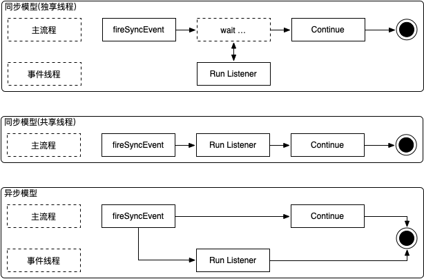

# Event Model

At the code level, different systems often still call each other directly or indirectly. To reduce code coupling, you can use Hasor's event mechanism for deeper decoupling.

Hasor events have three execution models:
- Synchronous with a dedicated thread.
- Synchronous with a shared thread.
- Asynchronous.



Whether the event model is synchronous or asynchronous, events in Hasor share the following characteristics:
- Event listeners execute in registration order.
- Event listeners use the same interface.
- Event registration uses the same approach.

## Registering Event Listeners

```java title='Implement a listener'
import net.hasor.core.EventListener;
public class MyListener implements EventListener<Object> {
    public void onEvent(String event, Object eventData) throws InterruptedException {
        Thread.sleep(500);
        System.out.println("Receive Message:" + JSON.toJSONString(eventData));
    }
}
```

```java title='Obtain the EventContext interface'
ApiBinder apiBinder = ... 
EventContext ec = apiBinder.getEventContext();

or

AppContext appContext = ...;
EventContext eventContext = appContext.getInstance(EventContext.class);

or

EventContext eventContext = appContext.getEventContext();

or

public class MyBean {
    @Inject
    private EventContext eventContext;
}
```

Then register the event in the container through `EventContext`.

```java title='Register an event listener'
EventContext eventContext = ...
eventContext.addListener("EventName",new MyListener());
```

## Firing Events

```java title='Example'
eventContext.fireSyncEvent("EventName",...);
```
