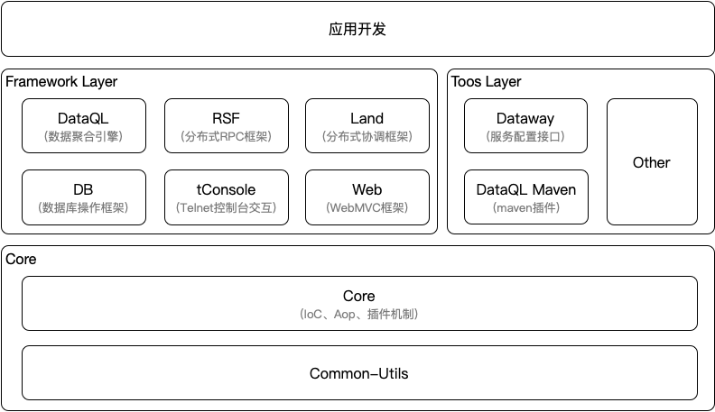

# Introduction

Hasor itself is a framework system composed of several different framework families. These sub-frameworks cover IoC, AOP, Web MVC, database access, and many other areas. All of this is built on Hasor's plugin capability.

Hasor helps you design better APIs. Its unique framework-extension capability lets new features integrate seamlessly into a unified API system. We build common capabilities so you can extend Hasor through plugins instead of adding every feature directly to the core framework.

Hasor's extension mechanism is like an interface for building blocks: anyone can provide new blocks in a very simple way and then combine them easily. During use, you do not feel that multiple different frameworks are cooperating behind the scenes. The Hasor API itself is a good example of this idea.

Hasor's goal is to make development and debugging easier and faster, not harder and slower.

## Features

Hasor is designed around a "microkernel + plugins" model. The microkernel provides only a small set of necessary capabilities, while everything else is implemented through plugins. As a result, extending Hasor means adding plugins without changing the core framework.

Hasor's unique API fusion mechanism lets new framework capabilities integrate seamlessly into the unified API system. The following diagram shows the current Hasor framework system.

